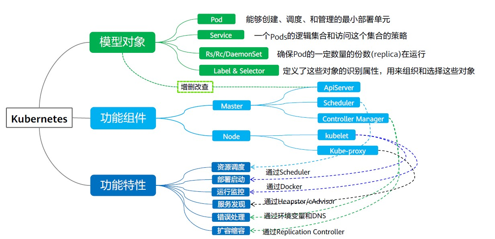
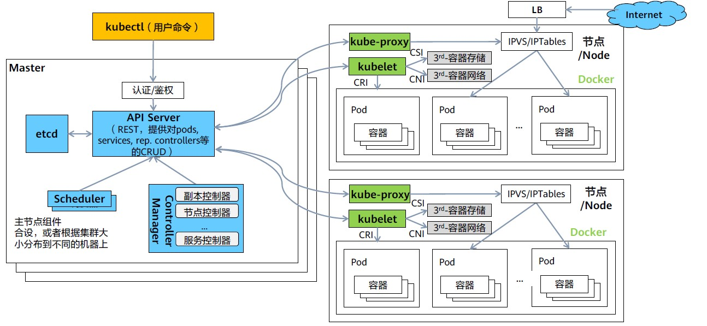

# Kubernetes概览

Kubernetes是Google开源的容器集群管理系统；它构建在容器技术之上，为容器化的应用提供资源调度，部署运行，服务发现，扩容缩容等一整套功能，本质上是基于容器技术的Micro-PaaS平台，Kubernetes的灵感来源于Google内部的Borg系统。

Kubernetes将容器宿主机组成集群，统一进行资源调度，自动管理容器生命周期，提供跨节点服务发现和负载均衡；更好的支持微服务理念，划分、细分服务之间的边界，比如lablel、pod等概念的引入。

**Kubernetes特点：** 轻量，迁移方便，部署快捷，插件化，可扩展。

## 关键对象

1. 模型对象：
   1. Pod: 能够创建、调度和管理的最小部署单元。
   2. Service: 一个Pods的逻辑集合和访问这个集合的策略。
   3. Rs/Rc/DaemonSet: 确保Pod的一定数量的份数（replica）在运行。
   4. Label & Selector: 定义了这些对象的识别属性，用来识别和组织这些对象。

2. 核心组件：
   1. Master节点的组件
      1. kube-ApiServer: 提供Kubbernets API，提供对PODs, Services, ReplicationController等对象的CRUD处理的REST操作，验证它们在Etcd中更新相应的对象API，不仅面向最终用户，也面向开工具和拓展的开发者，是开放生态的基础。
      2. Kube-Scheduler: 通过访问Kubernetes中/binding API, Scheduler负责在各个节点上分配。Schedulers是插件式的，K8s可以支持用户自定义的Scheduler。 
      3. Kube-Contorller-Marager: 控制器循环监听集群中资源状态，按照预期状态对资源进行管理。每个控制器就是将对应的资源牵引到期望的状态Kubernetes将来可以把这些控制器拆分并提供可插拔的组件。
   2. Node
      1. Kubelet: Kubelet管理pods和它们的容器、镜像、卷等。
      2. Kube-Proxy: Kube-proxy是一个简单的网络代理和负载均衡器。它具体实现Service模型，每个Service都会在所有的Kube-Proxy节点上体现。根据Service的selector所覆盖的Pods, 对这些Pods做负载均衡来服务于Service的访问者。
      3. Container Runtime: 容器运行环境是负责运行容器的软件。支持的运行时: Docker、containerd、CRI-O 以及任何实现Kubernetes CRI（容器运行环境接口）。
3. 功能特性
   1. 资源调度: 通过 Scheduler
   2. 部署启动: 容器运行时(Docker)
   3. 运行监控: Heapster / cAdvisor
   4. 服务发现: 通过环境变量和DNS
   5. 错误处理
   6. 扩容缩容: 通过Replication Controller



## 对象描述

Kubernetes中的对象使用**Yaml**(主要)或JSON描述。主要分为4部分：

1. typeMeta: 对象类型的元信息，声明对象使用哪个API版本，哪个类型的对象。
2. objectMeta: 对象的元信息，包括对象名称、使用的标签等。
3. spec: 对象的期望状态，例如对象使用什么镜像、有多少副本等。
4. status: 对象的实际状态，只能在对象创建后看到，创建对象时无需指定。**由Kubernetes定义，该字段对于最终用户是只读的**

**示例文件**
```yaml
# typeMeta: 
apiVersion: apps/v1
kind: Deployment

# ObjectMeta: 
metadata:
  name: nginx
  labels:
    app: nginx

# 期望状态
spec:
  selector:
    matchLabels:
      app: nginx
  replicas: 3
  template:
    metadata:
      lalebs:
        app: nginx
    spec:
      containers:
      - name: nginx
        image: nginx:alpine
        resources:
          requests:
            cpu: 100m
            memory: 200Mi
          limits:
            cpu: 100m
            memory: 200Mi
      imagePullSecrets:
      - name: default-secret

# 实际状态
status: {}
```

## 工作流程

