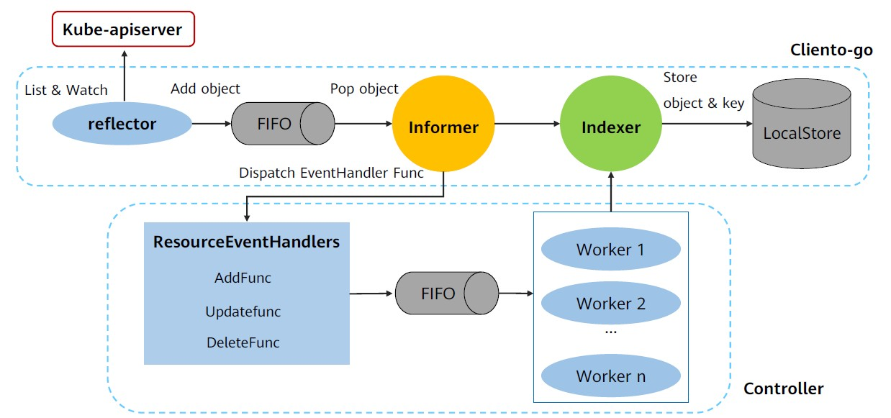
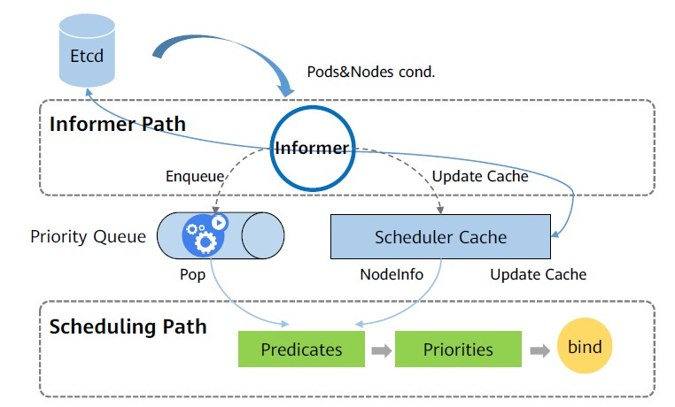
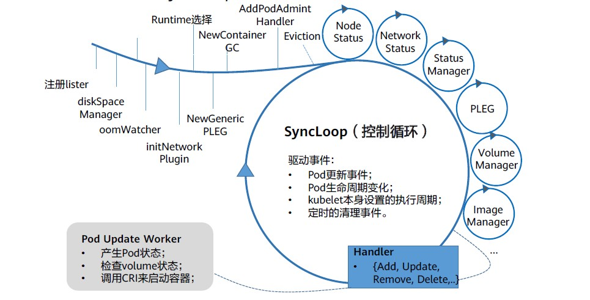
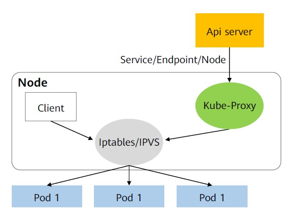

# 核心组件

## Etcd (公共核心组件)

etcd是一个分布式key-value存储系统，为Kubernetes提供原数据的存储。

- **接口简单：** 通过客户端或HTTP的方式访问；
- **数据表示简单：** 存储key-value数据，可理解为一个有序的map；
- **方便数据订阅：** 支持watch机制；

## Api-Server (Master)

Api-Server通过Master节点上的kube-apiserver进程提供服务，该服务是集群内各个功能模块之间数据交互和通信的中心枢纽，实现了 Kubernetes 对象模型（如 Pods, Services, Deployments 等）的 CRUD 操作。  
由于API Server承担了系统内关键的数据通信部分，所以API Server的性能高低决定了集群性能的高低。

使用 etcd 数据库作为持久化存储后端。所有 Kubernetes 对象的状态都保存在 etcd 中。

### API Server提供的API: 
1. /api/vi     - 核心API
2. /apis       - 分组API
3. /healthz    - 健康监测
4. /logs       - 日志
5. /swaggerapi - SwaggerAPI (OpenAPI)
6. /metrics    - 性能度量

### 访问控制
1. 授权
2. 身份验证
3. 准入控制

### 服务注册

1. Pod
2. NameSpace
3. Service
4. Apps
5. Storage
6. ...

## Controller Manager (Master)

在Kubernetes中，每个Controller是一个控制回路，通过APIServer监视集群内Node、Pod的等资源的状态，并确保其当前状态（由spec字段规定）接近期望状态。

Controller按照其实现方式，可以分为内部控制器和外部控制器。  
Kubernetes内部几乎每种特定资源都有特定的Controller维护管理，而ControllerManager的职责便是把所有的Controller聚合起来，以达到以下目的：
- 提供基础设施，启动和维持Controller的正常运行，降低Controller的实现复杂度。
- 通过Watch apiserver监控资源状态变化，对不同的Controller分发事件通知。

### Controller工作流程

Controller Manager主要提供了一个分发事件的能力，而不同的Controller只需要注册对应的Handler来等待接收和处理事件。在Controller Manager的帮助下，Controller的逻辑可以做的非常纯粹，只需要实现相应的EventHandler即可。以Deployment controller为例:

### 内部控制器
1. Deployment Controller： 用于管理应用程序的部署过程。
它基于 ReplicaSets 来管理 Pods，并支持滚动更新和回滚等高级部署策略。
2. ReplicaSet： 确保指定数量的副本（Pods）始终处于运行状态。如果 Pod 数量减少，它会自动创建新的 Pod；如果 Pod 数量超过期望值，则删除多余的 Pod。
3. StatefulSet Controller: 管理有状态的应用程序实例。维护持久的标识符和稳定的持久卷绑定。
4. DaemonSet Controller: 确保所有（或某些）节点上运行一个 Pod 的副本。常用于运行守护进程，如日志收集或监控代理。
5. Job Controller: 确保一个或多个任务完成指定次数的执行。通常用于批处理作业或一次性任务。
6. CronJob Controller: 创建基于时间的 Jobs，类似于 Unix cron 任务。
7. Namespace Controller: 管理 Namespace 的生命周期，包括删除 Namespace 及其关联资源。
8. Node Controller: 用于监控节点的状态，标记不健康的Node，并迁移其上的POD。 
9. Endpoints Controller: 更新每个Service的Endpoint列表，以反映实际可用的Pod。

## Kube-Scheduler

kube-scheduler组件是kubernetes默认的调度器，kube-scheduler组件内置的预选和优选算法，主要负责把创建的Pod调度到具体的工作节点上，完成Pod到Node的调度和预绑定工作。

### 工作流程
- Informer组件list-watch apiserver，同步etcd中Pod（spec.nodeName）信息的变化；
- 将未调度Pod的信息加入队列中，同时更新Scheduler Cache缓存，并获取Node列表；
- 预选阶段，针对Pod和Node列表执行Predicate算法，过滤掉不合适的节点；
- 优选阶段，针对Pod和Node列表执行Priority算法，给节点打分，根据打分，计算出得分最高的节点；
- 当调度器为Pod选择了一个合适的节点时，通过Bind将Pod和节点进行绑定；
- 更新缓存。

## Kubelet

kubelet用于处理master节点下发到本节点的任务，管理Pod以及Pod中的容器。kubelet的工作核心，就是一个控制循环，即：SyncLoop。

## Kube-Proxy

Kube-proxy是一个简单的网络代理组件，它的作用主要是负责Service的实现。

### 实现与工作原理

- **Kube-proxy：** 在每个节点上运行一个kube-proxy服务，监听API server中Service、Endpoint及Node的变化情况。
- **Iptables/IPVS：** Kube-proxy根据监听资源变化，操作代理后端来为服务配置负载均衡。目前Kube-proxy常用的代理模式为：
    - Iptables：Linux内核的一项功能。kube-proxy为每一个Serive创建相应的iptables规则，并将发送到Service的VIP（Cluster IP）的流量转发后端Pod的相应端口上。
    - IPVS：专门用于负载均衡的Linux内核功能，其功能依赖iptables，具有更好的扩展性和性能，支持更加复杂的负载均衡算法。

