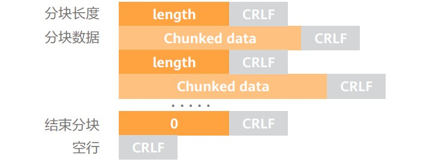
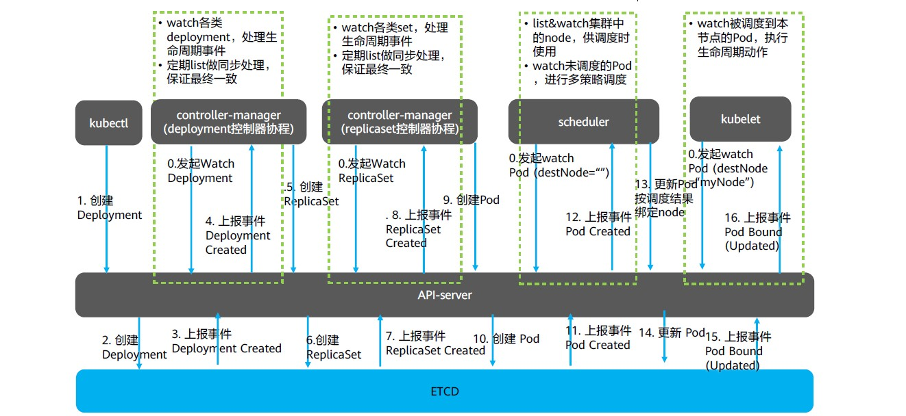

# Kube-ApiServer的List-Watch机制

我们知道kube-apiserver提供了一个Kubernetes中各种资源的增删改查的接口，不仅需要对内部其他四个组件提供服务，还需要给外部的用户以及集群内可能安装的插件使用，因此它接收到的请求量是十分巨大的，为了减少这种请求量，降低kube-apiserver的压力，便设计出了list-watch机制。

List-watch是Kubernetes统一的异步消息处理机制，各组件间协同都采用该机制进行通信，对系统的性能、数据一致性起到关键性的作用，为声明式风格的API奠定了良好的基础。它是优雅的通信方式，是Kubernetes架构的精髓。

List-watch由list和watch组成：
- list调用资源的list API罗列资源，获取静态的所有数据，主要用于查询，基于HTTP短链接实现。
- watch调用资源的watch API，监听每个资源的增删改事件，基于HTTP长链接实现。

## 一个异步消息的系统，对消息机制有至少如下四点要求：
- **消息的可靠性:** List API可以查询当前的资源状态，客户端通过期望的状态和实际的状态的对比，纠正状态不一致的资源，并可解决消息丢失的问题。
- **消息的实时性:** List-watch机制下，每当apiserver的资源产生状态变更事件，都会将事件及时的推送给客户端，从而保证了消息的实时性。
- **消息的顺序性:** 在并发的场景下，客户端在短时间内可能会收到同一个资源的多个事件，为保证资源的最终状态，K8S在每个资源的事件中都带一个resourceVersion的标签，这个标签是递增的数字，所以当客户端并发处理同一个资源的事件时，它就可以对比此标签来保证最终的状态和最新的事件所期望的状态的一致。
- **高性能:** 虽然仅通过周期性调用list API也能达到资源最终一致性的效果，但是周期性频繁的轮询大大的增大了开销，增加apiserver的压力。而watch作为异步消息通知机制，复用一条长链接，保证实时性的同时也保证了性能。


## List

List API可以查询当前的资源状态，客户端通过期望的状态和实际的状态的对比，纠正状态不一致的资源，并可解决消息丢失的问题。

## Watch

Watch是如何通过HTTP长链接接收apiserver发来的资源变更事件呢？秘诀就是Chunked transfer encoding（分块传输编码），它首次出现在HTTP/1.1。

Watch是通过HTTP长连接实现的，其秘诀就是通过响应头中声明Chunked transfer encoding（分块传输编码）。

> HTTP分块传输编码允许服务器为动态生成的内容维持HTTP持久链接。通常，持久链接需要服务器在开始发送消息体前发送Content-Length消息头字段，但是对于动态生成的内容来说，在内容创建完之前是不可知的。使用分块传输编码，数据分解成一系列数据块，并以一个或多个块发送，这样服务器可以发送数据而不需要预先知道发送内容的总大小。




## 通过CURL命令watch pods资源
当客户端调用watch API时，apiserver在response的HTTP Header中设置Transfer-Encoding的值为chunked，表示采用分块传输编码，客户端收到该信息后，便和服务端进行链接，并等待下一个数据块，即资源的事件信息。 

```
$ curl -ihttp://{kube-api-server-ip}:8080/api/v1/watch/pods?watch=yes
HTTP/1.1 200 OK
Content-Type: application/json
Transfer-Encoding: chunked
Date: Thu, 02 Jan 2020 20:22:59 GMT

{"type":"ADDED", "object":{"kind":"Pod","apiVersion":"v1",...}}
{"type":"ADDED", "object":{"kind":"Pod","apiVersion":"v1",...}}
{"type":"MODIFIED", "object":{"kind":"Pod","apiVersion":"v1",...}}
```

## Kubernetes基于list-watch机制的控制器架构
