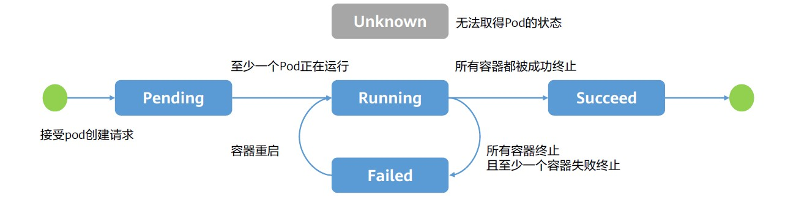

# Kubernetes的核心 - Pod

在Kubernetes中，pods是能够创建、调度、和管理的最小部署单元，是一组容器的集合，而不是单独的应用容器。

同一个Pod里的容器共享同一个网络命名空间，IP地址及端口空间。

从生命周期来说，Pod是短暂的而不是长久的应用。Pods被调度到节点，保持在这个节点上直到被销毁。

下面是一个定义Pod的基本要素：
```yaml
apiVersion: v1
kind: Pod

metadata:
  name: redis-django
  label: 
    app: webapp

spec:
  containers:
  - name: key-value-store
    image: redis
  - name: frontend
    iamge: django
```

## Pod的生命周期

Pod的status字段是一个PodStatus对象，PodStatus中有一个phase字段。phase是Pod在其生命周期中的简单宏观概述。

PodStatus对象还包含一个PodCondition。数组的每个元素都有一个type字段和一个status字段。
type字段是字符串，可能的值有
- PodScheduled
- Ready
- Initialized
- Unschedulable
- ContainersReady。

status字段是一个字符串，可能的值有
- True
- False
- Unknown



## 容器的生命周期和重启策略

一旦调度器将Pod分派给某个节点，kubelet就通过runtime为Pod创建容器。要检查Pod中容器的状态，你可以使用`kubectl describe pod <pod 名称>`。

容器的状态有三种：
- Waiting （等待）
- Running（运行中）
- Terminated（已终止）

如果容器中的进程能够在遇到问题或不健康的情况下自行崩溃，kubelet将根据Pod的`restartPolicy`自动执行修复操作。此字段可能取值包括`Always`、`OnFailure`和`Never`，默认值是`Always`。

```yaml
apiVersion: v1
kind: Pod
metadata:
  name: command-demo
  labels:
    purpose: demonstrate-command
spec:
  containers:
  - name: command-demo-container
    image: debian
    command: ["printenv"]
    args: ["HOSTNAME", "KUBERNETES_PORT"]
  restartPolicy: Always
```

## 容器

**Infra/PauseContainer：** 基础容器, pod中所有容器的父容器，为其他容器提供共享的命名空间和网络空间
- 用户不可见，无需感知。

**InitContainers：** 初始化容器，一般用于服务等待处理以及注册Pod信息等。
- 先于业务容器开始执行；
- 顺序执行，执行成功退出（exit 0），全部执行成功后开始启动业务容器。

**Containers：** 业务容器。
- 并行启动，启动成功后一直Running。

```yaml
apiVersion: v1
kind: Pod

metadata:
  name: myapp-pod
  label:
    app: myapp

spec:
  initContainers:
  - name: init-container
    image: busybox
    command: ['sh', '-c', 'until nslookup myservice; do echo waiting for myservice; sleep 2; done;']
  - name: init-mydb
    image: busybox
    command: 
    - sh
    - -c
    - until nslookup mydb; do echo waiting for mydb; sleep 2; done;
  containers:
  - name: myapp-container
    image: busybox
    command: ['sh', '-c', 'echo The App is Running ... && sleep 3600']
```

## 启动命令

在创建Pod时，可以为其下的容器设置启动时要执行的命令和参数。

启动命令：
- `command`: 设置命令，替换镜像中的entrypoint和CMD。
- `args`: 设置命令的参数，作为entrypoint的入参。

查看结果：
通过Pod的日志进行查看：`$ kubectl logs command-demo`

## 镜像

Image: 镜像名称可以包含所在仓库的主机名及指定版本的标签。若不指定仓库的主机名和标签，Kubernetes默认使用Docker公共仓库，拉取最新版本镜像（:latest）。

imagePullSecret: 若Pod创建需从私有仓库读取镜像，则可通过配置此字段提供仓库的访问凭证。为保证凭据文件的安全，可事先将其创建为Secret再进行引用。

imagePullPolicy: 镜像拉取策略。
- IfNotPresent：优先使用本地镜像。
- Always：每次容器启动时都从镜像库拉取镜像。
- Never：仅使用本地镜像。

## 外部输入

Pod可以接收外部输入的方式： 环境变量、配置文件和密钥。

env: 环境变量，使用简单，但一但更改容器必须重启。
    - key-value直接定义。
    - valueFrom配置文件(ConfigMap)或密钥(Secret)。

volume: 以卷形式挂载到容器内使用，权限可控。
    配置文件(ConfigMap)或密钥(Secret).

Pod配置文件的部分示例：
```yaml
...
spec:
  containers:
    env: 
    - name: APP_NAME
      value: test
    - name: USER_NAME
      valueFrom:
        secretKey:
          key: username
          name: secret
    volumeMounts:
      mountPath: /config
      name: cfg

  volumes:
    name: cfg
    configMap:
      name: config
      items:
      - key: age
        path: age
```

## 探针(Probe)

探针（Probe）是由kubelet对容器执行的定期诊断。诊断方式主要有以下三种：
- ExecAction：在容器内执行指定命令。如果命令退出时返回码为0则认为诊断成功。
- TCPSocketAction：对指定端口上的容器的IP地址进行TCP检查。如果端口打开，则诊断成功。
- HTTPGetAction：对指定的端口和路径上的容器的IP地址执行HTTP Get请求。如果响应的状态码大于等于200且小于400，则诊断成功。

Kubelet可以于Pod执行的两种探针类型为：
- 存活探针（livenessProbe）：指示容器是否正在运行。如果存活探测失败，则kubelet会杀死容器，并且容器将受到其重启策略的影响。
- 就绪探针（readinessProbe）：指示容器是否准备好服务请求。如果就绪探测失败，Endpoint Controller将从与Pod匹配的所有Service的Endpoints中删除该Pod的IP地址。

用户通过`spec.container.livenessProbe`（或`spec.container.readinessProbe`）字段设置探针。Probes涉及的字段如下：
- initialDelaySeconds：容器启动后要等待多少秒后存活和就绪探测器才被初始化。默认值为10。
- periodSeconds：执行探测的时间间隔（单位：秒）。默认值为1。
- successThreshold：探测器在失败后，被视为成功的最小连续成功数。默认值为1。
- failureThreshold：当探测失败时，Kubernetes的重试次数。存活探测情况下的放弃就意味着重新启动容器。就绪探测情况下的放弃Pod会被打上未就绪的标签。默认值为3。

探针的示例配置：
```yaml
# 存活探针 - 检查文件/tmp/healthy 是否存在 (容器启动5s后开始，每次间隔5s)
livenessProbe:
  exec:
    command: ["cat", "/tmp/healthy"]
    initialDelaySeconds: 5
    periodSecond: 5

# 就绪探针 - 检查端口8080是否开放(容器启动后5s开始，每次间隔10s)
readinessProbe:
  tcpSocket:
    port: 8080
  initialDelaySeconds: 5
  periodSecond: 10

# 存活探针 - 检查http://lo:8080/healthz的状态码是否在200-399之间
livenessProbe:
  httpGet:
    path: /healthz
    port: 8080
    httpHeaders:
    - name: Custom-Header
      value: Awesome
  initialDelaySeconds: 3
  periodSeconds: 3
```

## 资源限制 - limit

Kubernetes的资源限制是通过每个容器containerSpec的resources字段进行设置的。

CPU资源：
- 单位：以CPU为单位，也支持带小数值的使用，如：cpu: “0.5”或cpu:500m。
- CPU请求（request）：创建容器时预分配的CPU资源。
- CPU限制（limit）：CPU的资源上限。

内存资源：
- 单位：以字节（byte）为单位，可表示为纯整数或定点整数：E、P、T、G、M、K或Ei、Pi、Ti、Gi、Mi、Ki。
- 内存请求（request）：创建容器时预分配的内存资源。
- 内存限制（limit）：内存的资源上限。

```yaml

spec:
  containers:
  - image: nginx
    name: nginx
    ports:
    - containerPort: 80
    resources:
      requests:
        memory: "100Mi"
        cpu: "250m"
      limits:
        memory: "200Mi"
        cpu: "500m"
```

