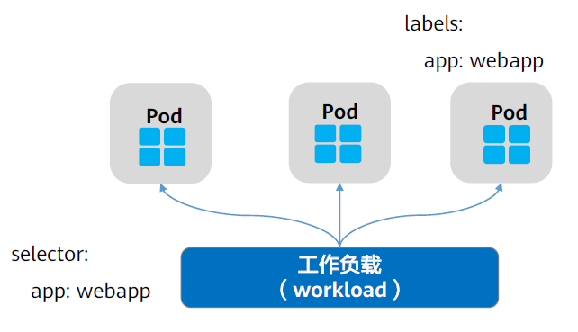
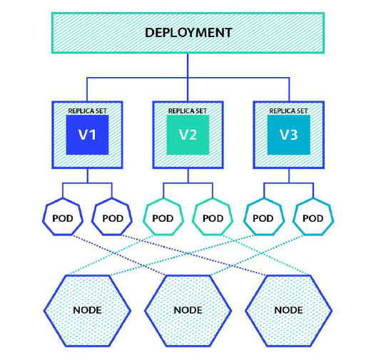
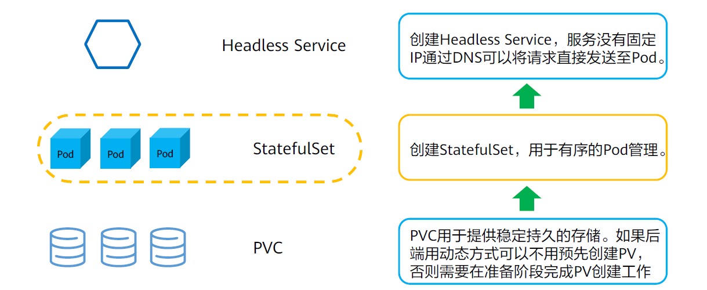

我们可以使用负载资源来管理一组Pods，通过配置Controller来保证处于运行状态的Pod个数是正确的，且其状态与所指定的状态相一致。两者通过label-selector和owerReference相关联，Pod通过工作负载实现应用的运维，如伸缩、升级等。


**Kubernetes内置的工作负载有：**
- 无状态工作负载：ReplicaSet、Deployment
- 有状态工作负载：StatefulSet
- 守护进程工作负载：DeamonSet
- 批处理工作负载：Job/CronJob



## Deployment

- ReplicaSet：副本控制器，用于确保Pod的一定数量的份数(replica)在运行，用于解决pod的扩容和缩容问题，通常用于无状态应用。
- Deployment：通过“控制器模式”，来操作ReplicaSet对象（而非直接操作Pod对象）的个数和属性，进而实现“水平扩展/ 收缩”和“滚动更新”这两个编排动作。



### Deployment - 副本管理

扩容/缩容Deployment指增加或减少它的副本数。最简单的方式是更新其yaml中的replicas字段。

Deployment的副本机制是通过，ReplicaSet实现的。这一点可通过查看对应Pod的ownerReference字段查看： 


如果给定如下配置部署：
```yaml
apiVersion: apps/v1
kind: Deployment
metadata:
  name: nginx
    labels:
      app: nginx
spec:
  replicas: 5
  selector:
    matchLabels:
    app: nginx
  template:
    metadata:
      labels:
        app: nginx
  spec:
    containers:
    - name: nginx
      image: nginx:1.7.9
      ports:
      - containerPort: 80
```
查询到的结果如下：
```
$ kubectl get pods --output=yaml| grep ownerReference–A 6 
ownerReferences:
  - apiVersion: apps/v1
    blockOwnerDeletion: true
    controller: true
    kind: ReplicaSet
    name: nginx-7848d4b86f
    uid: 2b3c788e-3b09-44bb-b0fb-0bd7f17ccfe8
```

### Deployment - 滚动更新

滚动更新允许通过使用新的实例逐步更新Pod实例，零停机进行Deployment更新。新的Pod将在具有可用资源的节点上进行调度。

滚动更新允许以下操作：
- 将应用程序从一个环境提升到另一个环境（通过容器镜像更新）；
- 回滚到以前的版本；
- 持续集成和持续交付应用程序，无需停机。

#### 操作命令
```
更新Deployement
$ kubectl edit deploy/nginx
$ kubectl set image deploy/nginxnginx=nginx:1.9.1
$ kubectl apply -f nginx.yaml

查看Deployment滚动更新情况/历史：
$ kubectl rollout status deploy/nginx
$ kubectl rollout history deploy/nginx

回滚：
$ kubectl rollout undo deployment/nginx--to-revision=2
#不指定的话默认回滚到上一个版本

暂停/恢复：
$ kubectl rollout pause deployment/nginx
$ kubectl rollout resume deploy/nginx
```

## StatefulSet

StatefulSet 是 Kubernetes 中的一种工作负载控制器，专门用于管理有状态的应用程序。与无状态的应用程序不同，有状态的应用程序通常需要持久化的存储和稳定的身份标识。StatefulSet 为这类应用程序提供了必要的支持。



### StatefulSet 的特点
1. **稳定的持久化存储:** StatefulSet 支持每个 Pod 与一个或多个持久卷（Persistent Volume, PV）相关联，这样每个 Pod 就有了自己独立的存储空间。
2. **稳定的网络标识:** StatefulSet 为每个 Pod 分配一个稳定的、唯一的网络标识符（通常是 DNS 名称或主机名）。这意味着 Pod 在整个生命周期内拥有相同的名称，即使 Pod 重启也不会改变。
3. **有序部署和缩放:** StatefulSet 支持有序的部署和缩放操作。这意味着 Pod 可以按顺序部署或缩放，例如从序号最小的 Pod 开始。
4. **有序滚动更新:** StatefulSet 支持有序的滚动更新，即 Pod 的更新按照一定的顺序进行，确保更新过程中应用程序的可用性。
5. **Headless Service:** StatefulSet 通常与 headless Service 结合使用，这意味着 Service 不会分配一个 Cluster IP。相反，Service 会为每个 Pod 分配一个 DNS 记录，这样每个 Pod 都可以通过自己的 DNS 名称被其他服务发现。

### 创建Handless服务

创建Headless服务需注意以下几点：
- 服务名称和StatefulSet中的定义一致；
- 选择器要指向正确的Pod标签；
- 指定clusterIP：None。

创建步骤：
- 编辑headless.yaml
```yaml
# headless.yaml
apiVersion: v1
kind: Service # 对象类型为Service
metadata:
  name: nginx
    labels:
      app: nginx
spec:
  ports:
  - name: nginx# Pod间通信的端口名称
    port: 80 # Pod间通信的端口号
  selector:
    app: nginx# 选择标签为app:nginx的Pod
  clusterIP: None # 必须设置为None
```
- 创建Headless Service：
`kubectl create -f headless.yaml`

- 查询Service：
```
kubectl get svc
NAME    TYPE      CLUSTER-IP  EXTERNAL-IP   PORT(S)   AGE
nginx   ClusterIP None        <none>        80/TCP    5s
```

### 创建 StatefulSet

- 创建并编辑yaml文件
```yaml
apiVersion: apps/v1
kind: StatefulSet

metadata:
  name: web
spec:
  selector:
    matchLabels:
      app: nginx
  serviceName: nginx
  replicas: 3
  template:
    metadata:
      labels:
        app: nginx
  spec:
    containers:
    - name: nginx
      image: nginx
      ports:
      - containerPort: 80
        name: web
      volumeMounts:
      - name: www
        mountPath: /usr/share/nginx/html

  volumeClaimTemplates:
  - metadata:
    name: www
    annotations:
      everest.io/disk-volume-type: SAS
  - spec:
    accessModes:
    - ReadWriteOnce
    resources:
    requests:
      storage: 1Gi
    storageClassName: csi-disk
```

- 创建StatefulSet `kubectl apply -f web.yaml`
- 创建完成后，可看到Pod名称按序号排序：
```
kubectl get pod
NAME    READY   STATUS    RESTARTS  AGE
web-0   1/1     Running   0         5m28s
web-1   1/1     Running   0         5m21s
web-2   1/1     Running   0         4m56s
```

- 后台已创建三个PVC，名称相同，以序号排序，依次和PV做绑定：
```kubectl get PVC
NAME        STATUS  VOLUME  CAPACITY  ACCESS  MODES STORAGECLASS  AGE
stor-web-0  Bound   myPV1   1Gi       RWO     my-sc               65s
stor-web-1  Bound   myPV2   1Gi       RWO     my-sc               58s
stor-web-2  Bound   myPV3   1Gi       RWO     my-sc               33s
```

- 使用nslookup查看DNS记录，可以看到对该服务的访问直接指向Pod：
```
Name: nginx

Address 1: 10.244.1.99 web-2.nginx.default.svc.cluster.local
Address 2: 10.244.2.120 web-0.nginx.default.svc.cluster.local
Address 3: 10.244.0.25 web-1.nginx.default.svc.cluster.local
```

### 副本管理
扩容/缩容StatefulSet指增加或减少它的副本数。这可以通过更新replicas字段完成。

  当缩容StatefulSet时，可以看到Pod停止的顺序为从序号最高的开始降序终止，并且只有在前一个pod被完全终止后，下一个才开始终止。升级时，也是以相同顺序处理。

StatefulSet的副本管理由StatefulSet控制器实现的。这一点可通过查看对应Pod的ownerReference字段查看：
```yaml
ownerReferences:
- apiVersion: apps/v1
  blockOwnerDeletion: true
  controller: true
  kind: StatefulSet #
  kind: StatefulSet #
  name: web
  uid: 0230cddd-5746-4f20-82c5-25253180975e
```


## DaemonSet


## Job


## CronJob