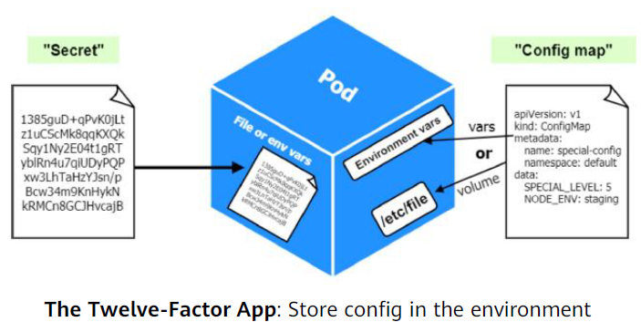

应用配置存在的问题：
- 可变的配置信息：如数据库的配置、证书的配置、应用自定义配置等；
- 敏感信息的存储和使用：如密码、token等。

Kubernetes应用配置：
- ConfigMap：管理一般可变配置信息；
- Secret: 敏感信息配置，信息采用base-64编码进行保存。



## ConfigMap

ConfigMap是一种存储非敏感数据的资源对象，以`<key-value>`形式存储配置数据。

ConfigMap设计要素：
- 解耦应用程序（镜像）和配置参数；
- 不用于存储大块数据（<=1 MB）。

ConfigMap主要服务于Pod：
- 为容器提供环境变量；
- 为容器提供命令行参数；
- 为容器提供配置文件。

### 定义ConfigMap：
```yaml
apiVersion: v1
kind: ConfigMap

metadata:
  name: game-demo

data:
  # 简单键值对
  player_initial_lives: 3
  ui_properties: |
    enemy.types=aliens,monsters
    player.maximum-lives=5
  # 文件或目录: 文件名为Key
  user-interface.properties:
    color.good=purple
    color.bad=yellow
    allow.textmode=true
```
### 使用ConfigMap

1. 使用ConfigMap配置环境变量:
```yaml
apiVersion: v1
kind: Pod
metadata:
  name: configmap-test-demo
spec:
  containers:
  - name: demo
    image: alpine
    command: ["sleep", "3600"]
    env: 
    - name: TEST_1
      valueFrom:  
        configMapKeyRef:  # 使用ConfigMapKeyRef从ConfigMap中拿到key的Value并绑定到环境变量TEST_1
          name: game-demo
          key:  player_initial_lives
    - name: TEST_2  
      valueFrom:
        configMapKeyRef:  # 同上
          name: game-demo
          key:  ui_properties_file_name
```

2. 使用ConfigMap挂载配置文件:
```yaml
apiVersion: v1
kind: Pod
metadata: 
  name: configmap-demo-pod

spec:
  containers:
  - name: demo
    image: alpine
    volumeMounts:
    - name: config
      mountPath: /config
      readOnly: true
  volumes:
  - name: config  
    ConfigMap:
      name: game-demo
      items:  # 存在Items时，config被定义为一个目录
      - key: game.properties
        path: game.properties
```

## Secret

Secret是一种资源对象，以`<key-value>`形式存储敏感数据（密码，token等）。

Secret设计要素：
- 数据采用base-64编码保存（非加密）；
- 通常结合RBAC rules来加强安全性。

Secret主要服务于Pod：
- 为容器提供环境变量；
- 为容器提供镜像仓库密钥（由kubelet使用）；
- 为容器提供配置文件。

### 定义一个Secret
```yaml
apiVersion: v1
kind: Secret
metadata: 
  name: mySecret
type: Opaque
data:
  username: YWRtaW4=
  password: MWYyZDFlMmU2N2Rm
```

### 使用Secret

1. 使用Secret配置环境变量:
```yaml
apiVersion: v1
kind: Pod
metadata:
    name: mypod
spec:
    containers:
    - name: mycontainer
      image: redis
      env:
      - name: SECRET_USERNAME
        valueFrom:
        secretKeyRef:
          name: mysecret
          key: username
      - name: SECRET_PASSWORD
        valueFrom:
          secretKeyRef:
            name: mysecret
            key: password
```
2. 使用Secret挂载配置文件:
```yaml
apiVersion: v1
kind: Pod
metadata:
  name: mypod

spec:
    containers:
    - name: mypod
      image: redis
      volumeMounts:
      - name: foo
        mountPath: "/etc/foo"
        readOnly: true
    volumes:
    - name: foo
      secret:
        secretName: mysecret  # foo被定义为一个文件
        optional: false
```