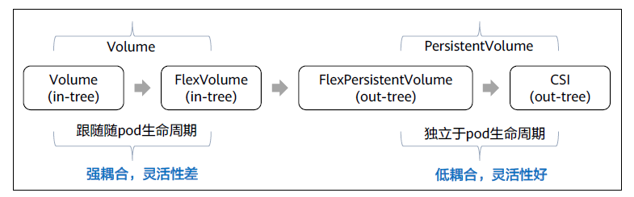
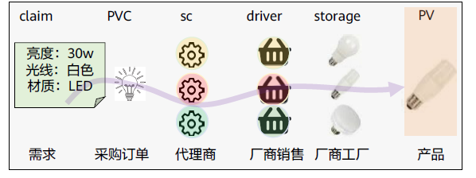
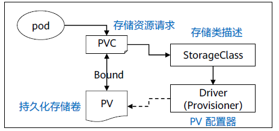
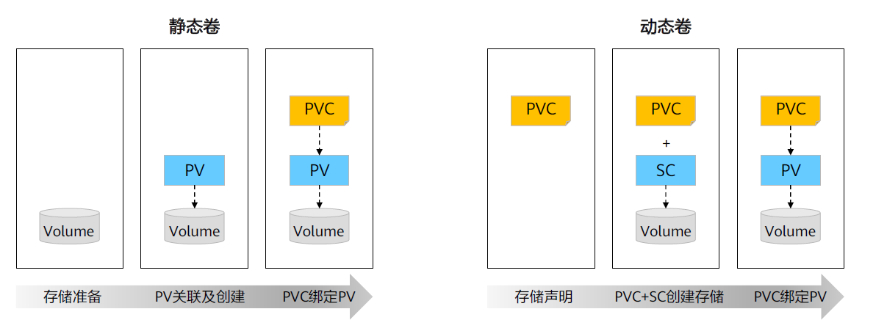
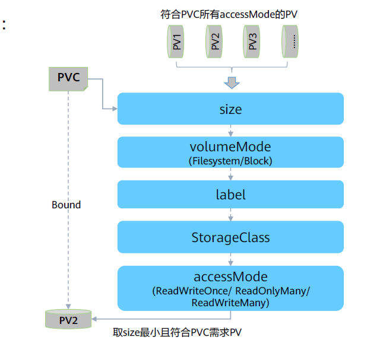
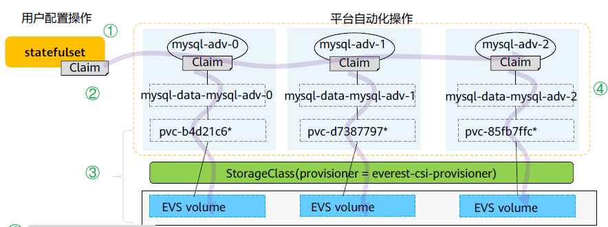

Kubernetes初期为存算分离所做的解耦设计Volume，采用强耦合、灵活性差的in-tree模式，虽然已经让用户专注于业务功能设计。但这类存储卷的生命周期是跟随pod的，只能用作存储临时数据，无法做为最终数据使用。

随着Kubernetes的不断成熟，为支持更多的应用场景，提供了一种脱离pod生命周期的、用户可管理的存储抽象设计低耦合、灵活性更强的PersistentVolume/PersistentVolumeClaim。




## 常用卷类型
Kubernetes支持的卷可分为以下几类：

- 临时存储：
  - EmptyDir：emptyDir生命周期和POD保持一致，pod删除后，emptyDir中的数据也会被清除。
  - HostPath：将节点本地文件系统的路径映射到pod容器中。pod删除后，HostPath中的数据是否清除，依赖于用户的pod配置。
  - In-tree的网络存储：网络存储跟随pod的生命周期，通过in-tree的存储插件对接不同类型存储。

- 持久存储声明
  - PersistentVolumeClaim：存储具有独立的生命周期，可以通过存储提供商提供的out-tree插件，对接其存储。

- 配置数据
  - ConfigMap/Secret：存储少量配置或敏感数据。

```yaml
spec:
  volumes: # 存储卷有多种类型，以下为一些常用类型
  - name: string # 存储卷名称
    emptyDir: {} # 临时生成的一个目录，与pod生命周期同步
  - name: string
    hostPath: # 挂载宿主机的目录
    path: string # 用于挂载的目录
  - name: string
    nfs:
      server: string # 服务IP地址
      path: string # 用于挂载的目录
  - name: string
    persistentVolumeClaim: # 调用已经创建的持久卷
      claimName: string # 持久卷声明的名称
  - name: string
    configMap/secret: # 挂载ConfigMap或Secret到容器内
      name: string # ConfigMap或Secret的名称
      items: # 要调用的键，值会被写入文件,可以设定多个
      - key: string
        path: string # 文件名
```

## 持久化存储体系介绍

k8s持久化存储体系包括：
- PersistentVolume：简称PV，持久化存储，是Kubernetes为云原生应用提供一种拥有独立生命周期的、用户可管理的存储抽象设计。
- PersistentVolumeClaim：简称PVC，持久化存储声明，是Kubernetes为解耦云原生应用和数据存储而设计的，通过PVC可以让资源管控更细更灵活、团队职责分离、应用模板更通用，进一步解除了用户被云平台锁定的顾虑。
- StorageClass：简称SC，存储类，是Kubernetes平台为存储提供商提供存储接入的一种声明，通过SC和相应的存储插件（CSI）为容器应用提供动态分配存储卷的能力。
- Driver Plugin：存储驱驱动插件，由存储提供商提供，能够对接网络存储，并管理持久存储卷的生命周期。
  


## 静态卷(Static Volumes) & 动态卷(Dynamic Volumes)

静态卷是在 Kubernetes 集群中预先创建好的 Persistent Volumes (PVs)。这些 PVs 通常由集群管理员手动创建，并配置好所有必要的参数，如存储后端、访问模式、存储大小等。静态卷不依赖于任何特定的 StorageClass。

### 静态卷 - 特点:
- 手动创建: 静态卷由管理员手动创建，并且在创建时就指定了所有必要的参数。
- 不依赖 StorageClass: 静态卷不依赖于 StorageClass，因此不会自动创建或销毁。
- 固定资源: 一旦创建，静态卷就存在于集群中，直到被明确回收或删除。
- 手动管理: 静态卷需要手动管理，包括创建、分配和回收

### 静态卷 - 适用场景
- 当需要特定的存储后端或存储配置时。
- 当存储资源有限且需要精细控制时。
- 当需要使用特定的存储后端，而该后端不支持动态配置时。

----

动态卷是由 StorageClass 自动创建的 Persistent Volumes (PVs)。当用户通过 Persistent Volume Claim (PVC) 请求存储资源时，动态卷会根据 PVC 中指定的 StorageClass 自动创建和配置 PV。

### 动态卷 - 特点
- 自动创建: 动态卷是在 PVC 被创建时自动创建的，由 StorageClass 配置。
- 依赖 StorageClass: 动态卷依赖于 StorageClass，后者定义了如何创建 PVs。
- 按需供应: 用户只需指定所需存储资源的大小和访问模式，PVs 将根据需要自动创建。
- 自动回收: 动态卷可以根据 StorageClass 中的配置自动回收。

### 动态卷 - 适用场景
- 当需要快速创建和销毁存储资源时。
- 当存储资源充足且不需要精细控制时。
- 当使用支持动态配置的存储后端时，如云提供商的存储服务。



## PV / PVC - 绑定原理

PVC刷选PV的流程（findBestMatchForClaim）：
- 通过size刷选恰当的PV；
- 通过volumeMode刷选一致的PV；
- 通过Label刷选合适的PV；
- 通过SC刷选符合的PV；
- 通过AccessMode刷选符合条件的PV；
- 返回并绑定符合PVC条件，且size最小的PV。



## PersistentVolume - 使用PV

PV中定义应用所需的规格等配置：
- accessModes：
  - ReadWriteOnce：读写权限，并且只能被单个Node挂载，如：云盘。
  - ReadOnlyMany：只读权限，允许被多个Node挂载，如：文件存储。
  - ReadWriteMany：读写权限，允许被多个Node挂载，如：文件存储。
- capacity.storage：容量大小
- csi：out-tree驱动配置信息。
- persistentVolumeReclaimPolicy：
  - Retain - 保留
  - Recycle - 回收空间
  - Delete：删除
- storageClassName：storageClass的名称。
- volumeMode：
  - Filesystem：将云盘挂载为文件系统。
  - Block：将云盘挂载为块设备。

PV声明：
```yaml
appVersion: v1
kind: PersistentVolume

metadata:
  name: static-volume

spce:
  accessModes: # 有多种访问模式，供PVC选择
  - ReadWriteOnce
  capacity:
    storage: 10Gi
  csi:
    driver: dick.csi.everest.io
    fsType: ext4
    volumeAttributes:
      everest.io/disk-mode: SCSI
      everest.io/disk-volume-type: SAS
      storage.kubernetes.io/csiProvisionerIdentity: everest-csi-provisioner
      volumeHandle: 9a074a5b-a67e-4fae-860e-07c5307594ea

  persistentVolumeReclaimPolicy: Retain
  storageClassName: csi-disk
  volumeMode: Filesystem
```

## PersistentVolumeClaim - 使用PVC

PVC中定义应用所需的规格等配置：
- accessModes：
  - ReadWriteOnce
  - ReadOnlyMany
  - ReadWriteMany，与PV设置相同。
- resources：
   - Requests：资源请求，与PV设置相同。
- volumeMode：
  - Filesystem：将云盘挂载为文件系统，与PV设置相同。
  - Block：将云盘挂载为块设备，与PV设置相同。
- volumeName/storageClassName：PV或者storageClass的名称。
- selector：通过对Label Selector的设置，可使PVC对于系统中已存在的各种PV进行筛选。

```yaml
apiVersion: v1
kind: PersistentVolumeClaim
metadata:
  annotations:
    everest.io/disk-volume-type: sas
    volume.beta.kubernetes.io/storage-provisioner: everest-csi-provisioner
  labels:
    app: mysql-adv-mgmd
    release: mysql-adv
  name: mysql-data-mysql-adv-mgmd-0
  namespace: default
spec:
  accessModes:
  - ReadWriteOnce
  resources:
    requests:
      storage: 10Gi
      volumeName/storageClassName: csi-disk
      volumeMode: Filesystem
  selector:
    matchLabels:
      release: "stable"
```

## StorageClass-使用SC

SC中定义存储类型和驱动等配置：
- Parameters：插件驱动定义的参数。
- Provisioner：指定存储卷的供应者。
- reclaimPolicy: Retain/Recycle/Delete：保留数据/回收空间/删除。
- volumeBindingMode：
  - Immediate：立即绑定。
  - WaitForFirstConsumer：延迟绑定。
- allowVolumeExpansion：
  - True：允许扩容。
  - False：不允许扩容。

定义SC：
```yaml
apiVersion: storage.k8s.io/v1
kind: StorageClass
metadata:
  name: csi-disk-ssd
parameters:
  csi.storage.k8s.io/csi-driver-name: disk.csi.everest.io
  csi.storage.k8s.io/fstype: ext4
  everest.io/disk-volume-type: SSD
  everest.io/passthrough: "true"
provisioner: everest-csi-provisioner
reclaimPolicy: Delete
volumeBindingMode: Immediate
allowVolumeExpansion: true
```

## 最佳实践

创建3个实例的MySQL服务：


```yaml
# 该Yaml中依次定义了所需要的全部文件。

# 1. 创建SC
apiVersion: storage.k8s.io/v1
kind: StorageClass
metadata:
  name: csi-disk-ssd
parameters:
  csi.storage.k8s.io/csi-driver-name: disk.csi.everest.io
  csi.storage.k8s.io/fstype: ext4
  everest.io/disk-volume-type: SSD
  everest.io/passthrough: "true"
provisioner: everest-csi-provisioner
reclaimPolicy: Delete
volumeBindingMode: Immediate
allowVolumeExpansion: true

---
# 2. 创建PVC - 0
apiVersion: v1
kind: PersistentVolumeClaim
metadata:
  name: mysql-data-0
spec:
  accessModes:
    - ReadWriteOnce
  resources:
    requests:
      storage: 10Gi
  storageClassName: csi-disk-ssd

---
# 2. 创建PVC - 1
apiVersion: v1
kind: PersistentVolumeClaim
metadata:
  name: mysql-data-1
spec:
  accessModes:
    - ReadWriteOnce
  resources:
    requests:
      storage: 10Gi
  storageClassName: csi-disk-ssd

---
# 2. 创建PVC - 2
apiVersion: v1
kind: PersistentVolumeClaim
metadata:
  name: mysql-data-2
spec:
  accessModes:
    - ReadWriteOnce
  resources:
    requests:
      storage: 10Gi
  storageClassName: csi-disk-ssd
---
# 3.创建ConfigMap定义MySQL配置文件
apiVersion: v1
kind: ConfigMap
metadata:
  name: mysql-config
data:
  my.cnf: |
    [mysqld]
    bind-address = 0.0.0.0
    innodb_file_per_table = 1
    character-set-server=utf8mb4
    collation-server=utf8mb4_unicode_ci
    skip-name-resolve

---
# 4. 创建 StatefulSet

apiVersion: v1
kind: StatefulSet
metadata:
  name: mysql

spec:
  serviceName: mysql
  replicas: 3
  seletor:
    matchLabels:
      app: mysql
  template:
    metadata:
      labels:
        app: mysql
  spec:
    containers:
    - name: mysql-adv
      image: mysql:5.7
      env: 
      - name: MYSQL_ROOT_PASSWORD
        valueFrom:
          secretKeyRef:
            name: secret_mysql
            key: root_password
      ports:
      - containerPort: 3306
      volumeMounts:
      - name: mysql-data
        mountPath: /var/lib/mysql
      - name: mysql-config
        mountPath: /etc/mysql/conf.d
    volumes:
    - name: mysql-config
      configMap:
        name: mysql-config
  
  volumeClaimTemplates:
  - metadata:
      name: mysql-data
      annotations: everest.io/disk-volume-type:SATA
    spce:
      accessModes: ["ReadWriteOnce"]
      storageClassName: csi-disk-ssd
      volumeMode: FileSystem
      resources:
        requests:
          storage: 10Gi

---
# 创建Service，提供访问接口
apiVersion: v1
Kind: Service
metadata:
  name: mysql
spec:
  selector:
    app: mysql
  ports:
  - port: 3306
    containerPort: 3306
  clusterIP: None  # 使用 Headless Service
```

- 应用上述文件`kubectl apply -f temp.yaml` 将会创建3个有状态的MySQL实例，每个实例绑定一个PVC，拥有10Gi存储。
- 查看PVC `kubectl get pvc`
- 查看PV  `kubectl get pv`

