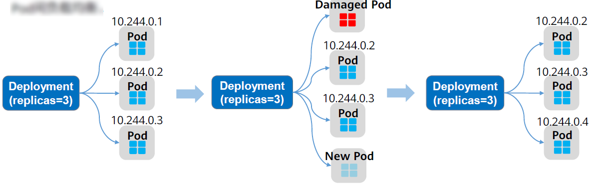
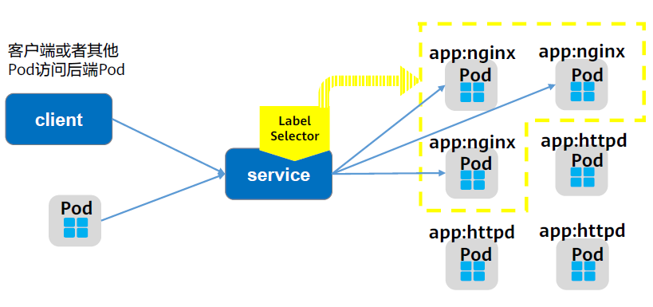
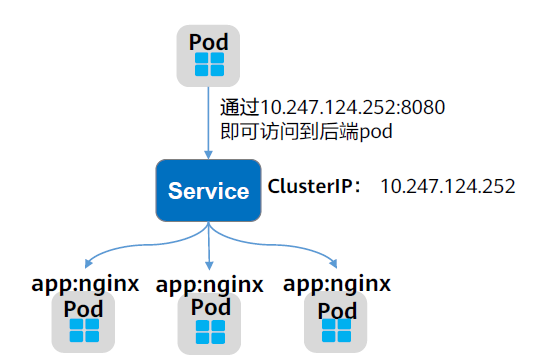
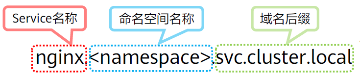
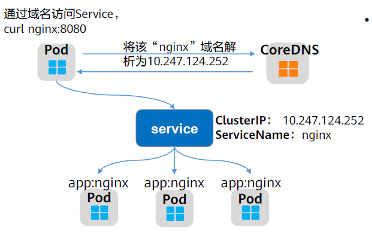
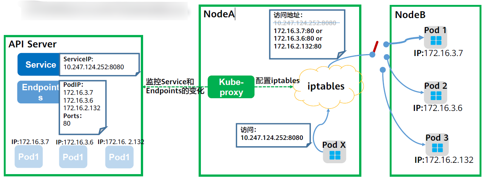
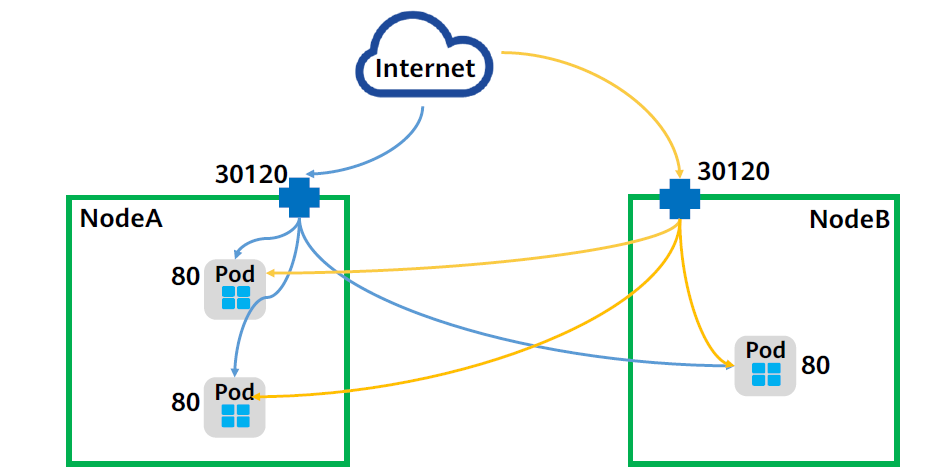
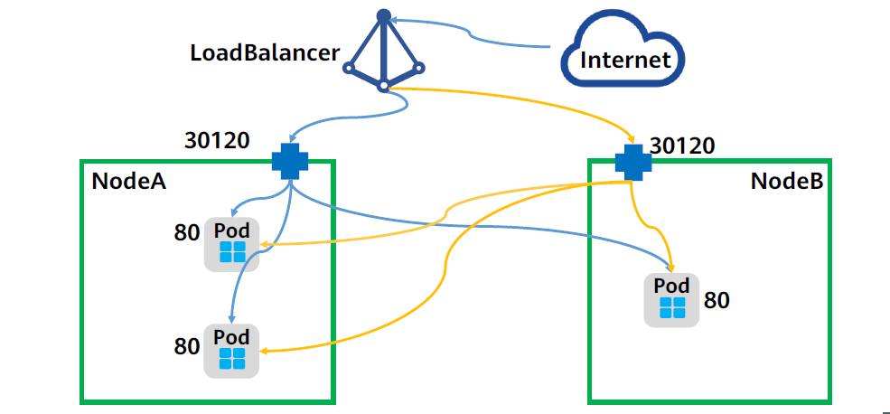
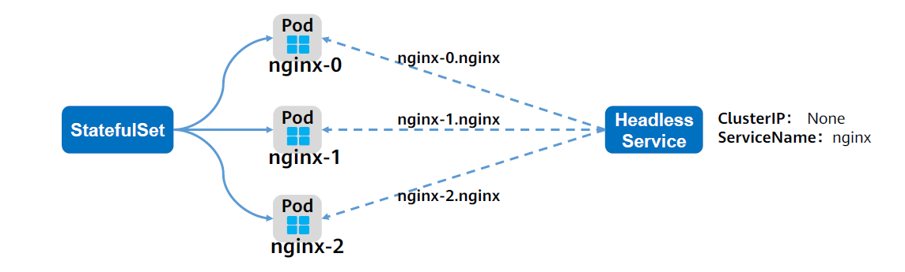

由于直接访问Pod存在一下问题：
- 每个Pod在启动后才会被分配一个可独立访问的IP，与其生命周期绑定，在Pod启动前并不知道Pod的IP地址。
- 当Pod被删除或者Pod所在节点故障时，Kubernetes会根据副本期望数重新拉起新pod，旧的PodIP可能无法正常访问。
- 应用往往有多个副本实例（Pod），多个副本实例共同对外提供服务。使用单一的PodIP进行访问不能实现Pod间负载均衡。



所以Kubernetes引入Service解决Pod的访问问题

添加一个Service，即可通过Service来访问Pod，Service有一个固定IP的地址，将访问它的流量转发给Pod，具体转发给哪些Pod通过LabelSelector来选择。



## 创建Service

示例：
```yaml
apiVersion: v1
kind: Service
metadata:
  name: nginx       # Service的名称
spec:
  selector:         # 标签选择器，选择包含app=nginx标签的Pod
    app: nginx
  ports:
  - name: service0
    targetPort: 80  # Pod的端口
    port: 8080      # Service对外暴露的端口
    protocol: TCP   # 转发协议类型，支持TCP和UDP
  type: ClusterIP   # Service的类型
```

示例创建一个名为“nginx”的Service，通过selector选择到标签为“app:nginx”的Pod，目标Pod的端口为80，Service对外暴露的端口为8080，Service类型为ClusterIP，创建后kubernetes会自动为Service分配一个IP地址，如图示的10.247.124.252。



其他pod可通过ClusterIP:Port的形式访问到后端Pod。

## 使用Service

将上述Service的定义保存至nginx-svc.yaml文件中，使用kubectl命令创建该Service。
```
$ kubectl create -f nginx-svc.yaml
service/nginxcreated

$ kubectl get svc
NAME        TYPE      CLUSTER-IP      EXTERNAL-IP PORT(S)  AGE
kubernetes  ClusterIP 10.247.0.1      <none>      443/TCP  7h19m
nginx       ClusterIP 10.247.124.252  <none>      8080/TCP 5h48m
```

可以看到Service有个Cluster IP，这个IP是固定不变的，除非Service被删除，所以可以使用ClusterIP在集群内部访问Service。

## ServiceName访问Service

除了用ClusterIP的形式访问Service，也可以用ServiceName的形式来访问Service。

用ServiceName的形式来访问Service时，就需要DNS插件进行域名解析，在安装Kubernetes时，会默认要求安装CoreDNS插件。

在kube-system命名空间下可以查看到运行CoreDNS的Pod。 `kubectl get po --namespace=kube-system`

**访问形式：** `<ServiceName>.<namespace>.svc.cluster.local`


> 实际上在同一个命名空间中可以省略`<namespace>.svc.cluster.local`, 直接用ServiceName, 因为在同一个DNS搜索域中。  
> 例如之前创建的名为nginx的Service，直接通过“nginx:8080”就可以访问到Service，进而访问后台Pod。



Pod以ServiceName的形式也就是“ServiceName:Port”的形式访问时，CoreDNS就会将ServiceName解析为ClusterIP，从而访问到后端Pod。


## 实现原理

Service是如何做到使客户端或其他Pod能够稳定访问到一组运行着特定服务的后端Pod呢？

调用kubectldescribe命令查看Service的信息，则会看到如下回显：
```
$ kubectl describe svc nginx
Name: nginx
......
Endpoints: 172.16.2.132:80,172.16.3.6:80,172.16.3.7:80
......
```

可以看到一个Endpoints，Endpoints同样也是Kubernetes的一种资源对象。Kubernetes正是通过Endpoints监控到Pod的IP，从而让Service能够发现Pod。如执行命令kubectlget endpoints查看Endpoints的详细信息。
```
$ kubectlget endpoints
NAME    ENDPOINTS                                   AGE
nginx   172.16.2.132:80,172.16.3.6:80,172.16.3.7:80 5h48m
```

配置了selector的Service在创建时，会自动创建一个同名的Endpoints，通过Label Selector将带有相应标签的Pod筛选出来，Endpoints将这些Pod的IP及端口信息记录下来。

通过如下命令查看Pod的IP，可看到运行着nginx的Pod的IP与前述Endpoints对象维护的IP一致。
```
$ kubectl get po -o wide
NAME                    READY STATUS  RESTARTS AGE IP           NODE
nginx-869759589d-dnknn  1/1   Running 0      5h40m 172.16.3.7   192.168.0.212
nginx-869759589d-fcxhh  1/1   Running 0      5h40m 172.16.3.6   192.168.0.212
nginx-869759589d-r69kh  1/1   Running 0      5h40m 172.16.2.132 192.168.0.94
```

如果删除一个Pod，Deployment会将Pod重建，新的Pod IP会发生变化。
```
$ kubectldelete po nginx-869759589d-dnknn
pod "nginx-869759589d-dnknn" deleted

$ kubectlget po -o wide
NAME                    READY STATUS RESTARTS AGE   IP            NODE
nginx-869759589d-fcxhh  1/1   Running 0       5h41m 172.16.3.6    192.168.0.212
nginx-869759589d-r69kh  1/1   Running 0       5h41m 172.16.2.132  192.168.0.94
nginx-869759589d-w98wg  1/1   Running 0       7s    172.16.3.10   192.168.0.212
```

再次查看Endpoints，会发现Endpoints的内容也随着Pod发生了变化。

---

实际上，具体的Service流量路由是Kube-Proxy组件和Iptables来共同实现的。

在Service创建时Kubernetes会分配IP给Service，同时通过APIServer通知所有kube-proxy有新的Service创建了，kube-proxy收到通知后通过iptables记录Service和Pod的IP/端口对的关系，从而让Service在节点上可以被查询到。

**iptables**是运行在用户空间的应用软件，通过控制Linux内核netfilter模块，来管理网络数据包的处理和转发，可以将iptables理解为是一系列的规则，实现从Service到Pod的流量转发。

除了记录Service和Pod的IP/端口对的关系，**kube-proxy还会监控Service和Endpoints的变化**，从而保证Pod重建后仍然能通过Service访问到Pod。

下图是一个实际访问Service的图示，Pod X访问Service（10.247.124.252:8080），在发送数据包时，在节点上根据iptables规则，目的IP:Port被随机替换为后端Pod组中某一个Pod的IP:Port，从而通过Service访问到实际的Pod。



## Service的类型

Service的类型除了ClusterIP还有NodePort、LoadBalancer和Headless，这几种类型的Service有着不同的用途。

- ClusterIP：用于在集群内部互相访问的场景，通过ClusterIP访问Service。
- NodePort：用于从集群外部访问的场景，通过节点上的端口访问Service。
- LoadBalancer：用于从集群外部访问的场景，其实是NodePort的扩展，通过一个特定的LoadBalancer访问Service，这个LoadBalancer将请求转发到节点的NodePort，而外部只需要访问LoadBalancer。
- 特殊的Service类型 – Headless Service：用于Pod间的互相发现。

### NodePort

```yaml
apiVersion: v1
kind: Service
metadata:
  name: nodeport-service
spec:
  type: NodePort
  ports:
  - port: 8080
    target: 80
    nodePort: 30100
  selector:
    app: nginx
```
首先使用上面的YAML文件创建一个NodePort类型的Service，其中：
- Type：指定该Service类型为NodePort。
- spec.nodePort：可指定节点开放的端口，本例中指定了该端口为“30120”，如果不进行指定，kubernetes master将从给定的配置范围内（默认：30000~32767）分配端口。

Service创建完成后，可以通过“节点的IP:Port”的形式将流量转发到相应的Service，最后转发到后端Pod，**NodePort类型的Service也会被分配一个ClusterIP**。

NodePort类型的Service可以让Kubemetes集群每个节点上监听一个相同的端口，外部访问请求首先访问节点IP:NodePort，对应节点将这些请求转发给Service对应的Endpoints（即PodIP:targetPort）。



### LoadBalancer

LoadBalancer本身并不是Kubernetes的组件，这部分通常是由云服务厂商提供，不同厂商的Kubernetes集群与LoadBalancer的对接实现各不相同，这里以华为云对接弹性负载均衡ELB服务为例。
```yaml
apiVersion: v1
kind: Service
metadata:
  annotations:
    kubernetes.io/elb.id: 3c7caa5a-a641-4bff-801a-feace27424b6
  labels:
    app: nginx
    name: nginx
spec:
  type: LoadBalancer
  selector:
    app: nginx
  loadBalancerIP: 10.78.42.242
  ports:
  - name: service0
    port: 80
    protocol: TCP
    targetPort: 80
    nodePort: 30120
```

上面为一个LoadBalancer类型的Service实例的YAML文件，其中：
- metadata.annotations：表示CCE的LoadBalancer类型Service需要配置的参数，表示这个Service绑定哪个ELB实例。
- loadBalancerIP：指定ELB实例的IP地址。
- type：指定该Service类型为LoadBalancer。

使用该YAML文件创建LoadBalancer类型的Service后，可以通过ELB的IP:Port访问到后台Pod。

LoadBalancer类型的Service其实是NodePort类型Service的扩展，通过一个特定的LoadBalancer访问Service，该LoadBalancer将请求转发到节点的NodePort。(华为云云原生2.0网络支持ELB直通PodIP，无需经过NodePort转发。)



### Headless Service

通过ClusterIP可以实现Pod的内部访问，通过NodePort和LoadBalancer可以实现Pod的外部访问，那么如何实现一个Service内部的Pod之间的互相访问呢？

HeadlessService通过使用DNS，为每个Pod提供固定的域名，这样Pod之间就可以使用域名访问，即便Pod被重新创建而导致Pod的IP地址发生变化，这个域名也不会发生变化，从而实现Service内部的Pod之间的相互访问。



```yaml
apiVersion: v1
kind: Service
metadata:
  name: nginx
  labels:
    app: nginx

spec:
  ports:
  - name: nginx
    port: 80
  clusterIP: None
```

使用上面的YAML文件创建一个Headless类型的Service，其中：
- spec.ports.name：指定Pod间通信端口名称，这里设置为“nginx”；
- spec.ports.port：指定Pod间通信端口号，这里设置为“80”；
- spec.selector.app：指定选择标签为“app: nginx”的Pod；
- spec.clusterIP：必须设置为None，表示Headless Service。

#### 创建Headless Service

将上述的内容保存到headless.yaml中并执行创建命令`kubectl create -f headless.yaml`

创建完成后查询Service `kubectl get svc`
```
NAME  TYPE      CLUSTER-IP EXTERNAL-IP  PORT(S) AGE
nginx ClusterIP None<none>              80/TCP  5s
```

Headless Service创建后，每个Pod的IP都会有下面格式的域名：`<pod-name>.<svc-name>.<namespace>svc.cluster.local`
> 同样的，在同一个搜索域下的`.<namespace>.svc.cluster.local` 可以省略

