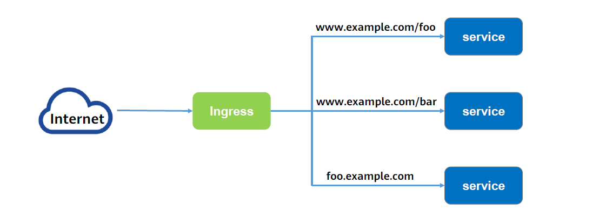
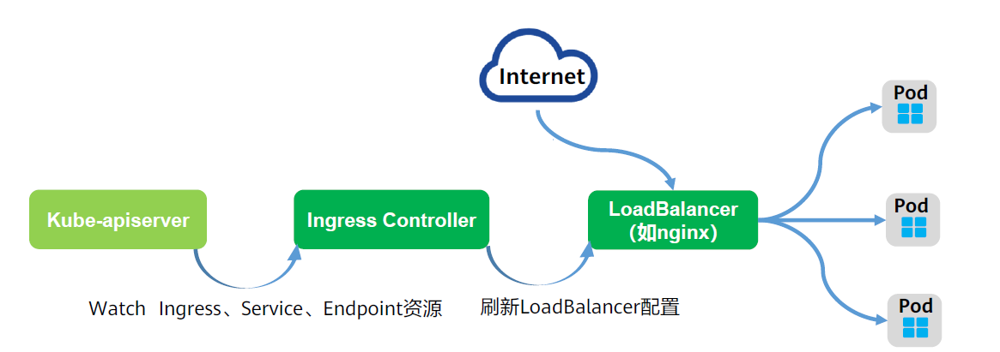
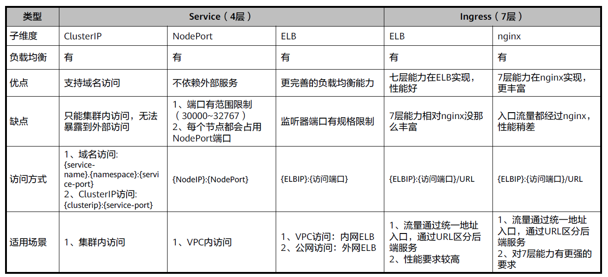
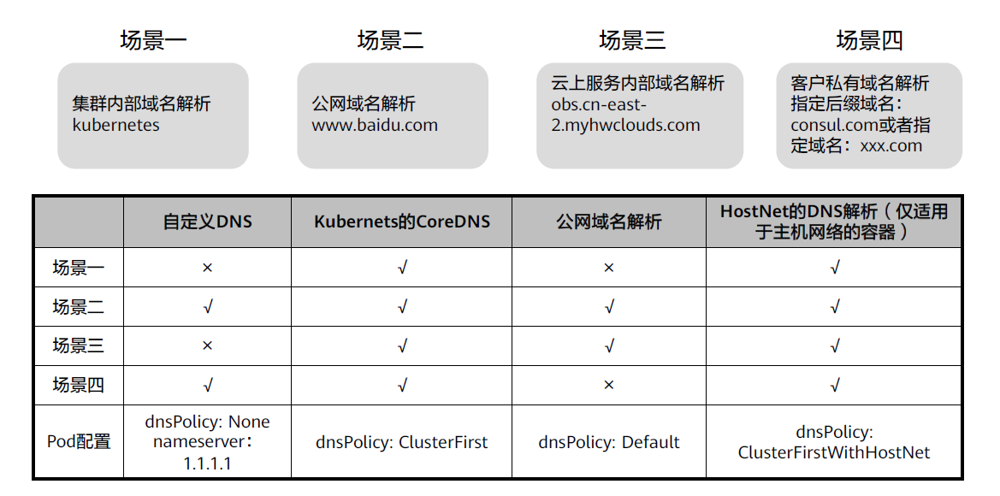

Service是实现基于4层TCP或UDP的流量转发与负载均衡，而Ingress可以通过七层的HTTP和HTTPS协议进行请求转发，可以通过域名和路径做到更细粒度的流量划分与转发。




## Ingress和Ingress controller

Ingress是Kubernetes中的一种资源对象，用来管理集群外部访问集群内部服务的方式；

可以通过Ingress资源来配置不同的转发规则，从而达到根据不同的规则设置访问集群内不同的Service所对应的后端Pod；

Ingress通过http或https暴露集群内部service，给service提供外部URL、负载均衡、SSL/TLS能力以及基于host的反向代理。

---
Ingress-controller是具体实现反向代理及负载均衡的程序，对ingress定义的规则进行解析，根据配置的规则来实现转发；

Ingress-controller并不是Kubernetes自带的组件，用户可以选择不同的ingress-controller实现，比如Kubernetes官方维护的NGINXIngressController，不同厂商通常有自己的实现，例如华为云CCE使用华为云弹性负载均衡服务ELB实现Ingress的七层负载均衡。

## Ingress Controller的工作原理

当用户创建活更新Ingress资源后，Ingress Controller就会根据其中定义的转发规则刷新LoadBalancer配置文件（如：nginx.conf，或者华为云ELB配置）中。在外部流量访问集群时，由LoadBalancer组件跟据转发规则将其转发至对应的各个工作负载。




## Ingress 配置文件示例

```yaml
apiVersion: networking.k8s.io/v1
kind: Ingress
metadata:
  name: minimal-ingress
  annotations:
    # 即注解内容，该内容用于配置一些选项，具体取决于Ingress Controller，不同的Ingress Controller支持不同的注解.
    nginx.ingress.kubernetes.io/rewrite-target: /

spec:
  rules:
  - http:
      paths:
      - path: /testpath
        # host: foo.service.com 可选：该规则适用于通过指定IP地址的所有入站HTTP通信。如果提供了host（例如foo.bar.com），则rules适用于该host。
        pathType: prefix
        backend: 
          service: 
            name: test
            port: 
              number: 80
```

解析：
**Metadata.annotations：** 即注解内容，该内容用于配置一些选项，具体取决于Ingress Controller，不同的Ingress Controller支持不同的注解，如以下示例即华为云CCE使用华为云弹性负载均衡服务ELB实现Ingress的注解内容，其中指定了“ingress.class”信息，ELB的IP、端口等信息。
```yaml
metadata:
name: test-ingress
annotations: # 指定使用的ELB实例的信息
kubernetes.io/ingress.class: cce
kubernetes.io/elb.port: '8080'
kubernetes.io/elb.ip: 192.168.10.155
kubernetes.io/elb.id: aa7cf5ec-7218-4c43-98d4-c36c0744667a
```

**spec.rules** 参数即转发规则，每个HTTP规则都包含以下信息：

- host（可选）：在此示例中，未指定host，因此该规则适用于通过指定IP地址的所有入站HTTP通信。如果提供了host（例如foo.bar.com），则rules适用于该host。

- paths（路径列表，例如，/testpath）：每个路径都有一个由serviceName和servicePort定义的关联后端。在负载均衡器将流量定向到引用的服务之前，主机和路径都必须匹配传入请求的内容。

- PathType（路径类型）：未明确设置pathType的路径无法通过合法性检查，当前支持三种路径类型：
  - Exact：精确匹配URL路径，且区分大小写
  - Prefix：基于以“/”分隔的URL路径前缀匹配，匹配区分大小写，并且对路径中的元素逐个完成。
  - ImplementationSpecific

- 后端（backend）是Service文档中所述的服务和端口名称的组合。与规则的host和path匹配的对Ingress的HTTP（和HTTPS）请求将发送到列出的backend。

如Ingress同时路由到多个服务，配置如下所示：
```yaml 
spec:
  rules:
  - host: foo.bar.com # host地址
    http:
    paths:
    - path: "/foo"  #当访问“http://foo.bar.com/foo”时，即访问到“s1:80”后端
    backend:
      serviceName: s1  
      servicePort: 80
    - path: "/bar"   #当访问“http://foo.bar.com/bar”时，即访问到“s2:80”后端
      backend:
        serviceName: s2  
        servicePort: 80
```

## Service 和 Ingress的对比



## DNS 策略对比

